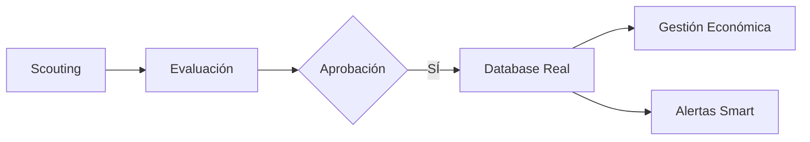

# ProneoManager: Dossier Ejecutivo v1.1

## 🎯 Resumen Ejecutivo
**ProneoManager** es una plataforma integral de gestión Deportiva, Legal y Económica diseñada específicamente para agencias de representación de élite. La herramienta centraliza toda la operativa diaria, desde el seguimiento de prospectos (scouting) hasta la gestión financiera avanzada y el cumplimiento contractual.

---

## 🏛️ Estructura de Roles y Permisos
El sistema utiliza un modelo de Control de Acceso Basado en Roles (**RBAC**) para garantizar la seguridad de los datos:

| Rol | Alcance | Funciones Clave |
| :--- | :--- | :--- |
| **Director / Admin** | Total | Gestión de facturación, usuarios y ajustes estructurales. |
| **Agente Proneo** | Gestión | Control de su propia cartera, alertas y reportes. |
| **Scouting** | Captación | Registro y filtrado de nuevos talentos en base de datos paralela. |
| **Invitado** | Consulta | Acceso restringido bajo aprobación directa del Director. |

---

## 🚀 Módulos Principales y Funcionalidades

### 1. Panel de Control Inteligente (Dashboard)
Una visión 360º de la salud de la agencia en tiempo real.
- **KPIs Críticos:** Jugadores activos, contratos por expirar y comisiones del mes.
- **Análisis Visual:** Gráficos dinámicos de crecimiento y distribución.

### 2. Gestión de Futbolistas (Database de Alto Rendimiento)
El corazón de la aplicación, diseñado para la eficiencia.
- **Tabla de Alta Densidad:** Gestión fluida de cientos de registros.
- **Ficha Integral:** Datos deportivos, históricos de salarios y almacén documental.
- **Esquema Dinámico:** Posibilidad de añadir cualquier campo nuevo al instante.

### 3. Scouting & Captación
Flujo de trabajo especializado para el equipo de detección de talento:
- **Base de Datos de Prospectos:** Segmentada para no mezclar con jugadores en cartera.
- **Conversión Directa:** Traslado automático de prospecto a jugador oficial con un clic.

### 4. Smart Alerts (Centro de Avisos)
Sistema de auditoría constante que vela por los intereses de la agencia:
- **Cumpleaños:** Notificaciones diarias para fidelización.
- **Alertas de Cláusula:** Avisos con 30/60 días de antelación para renovaciones críticas.
- **Alertas de Scouting:** Auditoría de fin de contrato de prospectos con otros agentes.

### 5. Administración y Finanzas
Control total de la rentabilidad:
- **Tracking de Comisiones:** Seguimiento de pagos de Clubes y Jugadores por temporada.
- **Facturación:** Gestión de estados de pago (Pagado, Pendiente, Pospuesto).

---

## 🛠️ Stack Tecnológico
- **Cloud Infrastructure:** Firebase (Google) para tiempo real y seguridad.
- **Performance:** React + Virtuoso para una navegación sin retardos.
- **Seguridad:** Autenticación de dominio restringido y backups automáticos.

---

## 💎 Valor de Negocio
1. **Seguridad Contractual:** Eliminación de errores humanos en fechas críticas.
2. **Imagen Corporativa:** Reportes y diseño de primer nivel para impresionar a clientes.
3. **Escalabilidad:** Pensado para crecer de 10 a 1000 jugadores sin perder el control.

---

